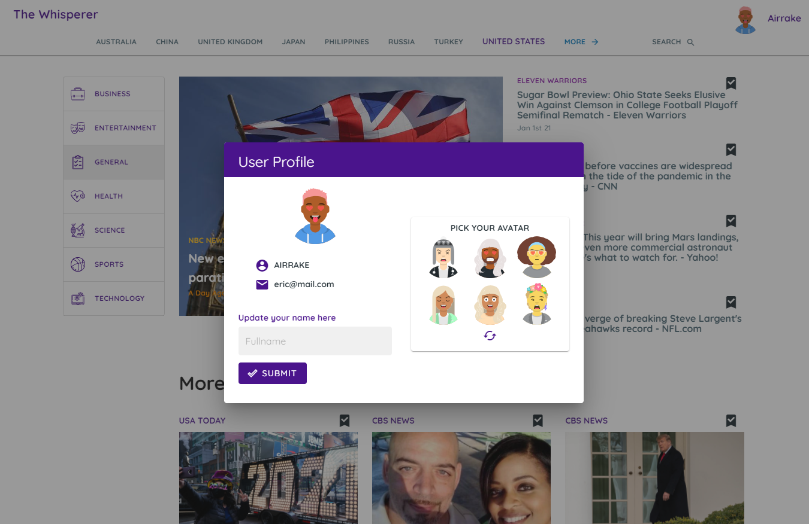

# news-nuxt

## Build Setup

```bash
# install dependencies
$ npm install

# serve with hot reload at localhost:3000
$ npm run dev

# build for production and launch server
$ npm run build
$ npm run start

# generate static project
$ npm run generate
```

# A NuxtJs Application build for top headlines worldwide with News API


## Build Applications Tools
  #### News API
  #### Firebase - Auth
  #### Firebase - Firestore
  #### Axios
  #### Vuetify
  #### Vuex


## Application Description

The application pulls the latest news headlines on key countries. They can select top headlines from country selection and also for specific news categories.

Users can also create accounts to bookmark favorite headlines and can be removed later. They can also select their own avatar profile.

## Checkout Page Preview 

### The app can be found at <a href="https://headline-whisperer.herokuapp.com/">https://headline-whisperer.herokuapp.com</a>

## Sample Account:
  email: eric@mail.com
  <br/>
  pass: password


  
  
  
